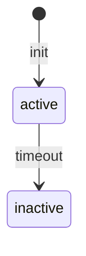

# Specs Publisher — Multi-Format Wiki Generator

Read markdown specs from `.specs/` (or user-specified directories) and publish them in the format of the user's choice. Detects which spec-driven tools generated the files and adapts accordingly.

## Hard Rules (Never Violate)

1. **NEVER render ANY flow, architecture, sequence, state machine, relationship, or process visually using ASCII characters.** Banned patterns include (but are not limited to): `-->`, `──►`, `│`, `├─►`, `└─►`, `▼`, `▲`, `|--|`, `+--`, `►`, `─`, `│`, `┐`, `└`, `┘`, `┌`, `├`, `┤`, `┬`, `┴`, `┼`, `║`, `═`, `╔`, `╗`, `╚`, `╝`, `╠`, `╣`, `╦`, `╩`, `╬`.

2. **Every visual representation MUST be a Mermaid code block:**
   ``````markdown
   ```mermaid
   flowchart TD
       A[Client] --> B[Core API]
       B --> C[External Vendor]
   ```
   ``````

3. **If you catch yourself typing ASCII arrows or boxes — STOP. Use Mermaid instead.**

4. **This applies to ALL output formats** — wiki, chat, markdown, code comments, everything.

5. **If the source markdown contains ASCII diagrams, rewrite them to Mermaid.**

## Trigger

When the user asks to build, generate, serve, or publish docs / wiki from spec markdown files. Also at session end when specs have accumulated without being published.

---

## Diagram Requirement — Always Use Mermaid

Any state flow, sequence, architecture, or process diagram in the output MUST use proper Mermaid syntax inside a fenced code block:

````markdown

````

**Do NOT** render diagrams as ASCII art (text characters like `-->`, `|`, `+--` drawn manually). ASCII diagrams are unreadable in wikis and cannot be edited. Mermaid renders natively in MkDocs Material (via `pymdownx.superfences`) and GitHub-flavored markdown.

When you encounter a diagram description in the source markdowns (e.g., "flow: X → Y → Z" or a text-based state diagram), convert it into proper Mermaid syntax.

Supported Mermaid diagram types for wikis:
- `flowchart` / `graph` — process flows, decision trees
- `sequenceDiagram` — request/response flows, API interactions
- `stateDiagram-v2` — state machines, lifecycle
- `classDiagram` — class structures, relationships
- `erDiagram` — entity-relationship models
- `gantt` — timelines, roadmaps
- `pie` — pie charts (rare, but valid)

---

## Step 1 — Onboarding Interview

Before touching any files, interview the user to build a clear specification of what they need. This eliminates ambiguity and ensures the output matches their real intent.

Use the `Question` tool for all choices. Free-form questions should be asked as text. Resolve ambiguities before moving on — if an answer is vague, drill in with follow-ups.

---

### 1a. Version check — is the skill up to date?

Before proceeding, check if the skill itself is outdated. The skill may be installed as a git clone (from GitHub) or as a direct copy.

```bash
# Check if this is a git repo
SKILL_DIR=$(dirname "$(find ~/.config/opencode/skills/md-to-wiki -name SKILL.md 2>/dev/null | head -1)")
if [ -z "$SKILL_DIR" ]; then
  SKILL_DIR=$(dirname "$(find .opencode/skills/md-to-wiki -name SKILL.md 2>/dev/null | head -1)")
fi
if [ -n "$SKILL_DIR" ] && [ -d "$SKILL_DIR/.git" ]; then
  cd "$SKILL_DIR"
  git fetch origin --quiet 2>/dev/null
  BEHIND=$(git rev-list --count HEAD..origin/main 2>/dev/null || echo 0)
  LOCAL=$(git rev-parse --short HEAD 2>/dev/null)
  REMOTE=$(git rev-parse --short origin/main 2>/dev/null)
  if [ "$BEHIND" -gt 0 ] 2>/dev/null; then
    echo "Skill is $BEHIND commit(s) behind. Local: $LOCAL | Remote: $REMOTE"
    OUTDATED=true
  else
    echo "Skill is up to date ($LOCAL)."
    OUTDATED=false
  fi
else
  OUTDATED=false
fi
```

If `OUTDATED=true`, ask the user:

> **This skill is $BEHIND commit(s) behind the latest version. Update now?**

- If yes: `cd "$SKILL_DIR" && git pull`
- If no: proceed with the current version

---

### 1b. Welcome and set context

Start with a brief summary of what the skill can do, then ask the opening question:

```
I can publish your spec markdowns into several formats:
  • Pure HTML site (GitHub docs style with search)
  • Swagger / OpenAPI (for API specs)
  • GitHub Wiki tab (push to repo.wiki.git)
  • DokuWiki (self-hosted wiki format)
  • PDF document (single book for review)

Let's start with a quick onboarding so I understand exactly what you need.
```

---

### 1c. Goals — what should the documentation achieve

Ask:

> **What are the main goals of this documentation? Who is it for?**

Probe for:
- **Audience**: Developers? Stakeholders? QA? New team members? External partners?
- **Purpose**: Reference? Onboarding? Compliance? API docs? Progress tracking?
- **Tone**: Technical deep-dive? Executive summary? Both?

If the answer is vague, drill in:

| Vague answer | Follow-up |
|-------------|-----------|
| "Document the project" | Who needs to read it? What decisions will they make from it? |
| "For the team" | Which part of the team — devs, PMs, QA, or all? |
| "API docs" | Who consumes the API — internal services, external partners, mobile apps? |
| "Everything" | That's broad. Let's prioritize — what's the top 3 things someone should find? |

Also ask if there are existing docs they want to replace or complement.

---

### 1d. Scope and context — what does the documentation cover

Ask:

> **What's the scope of this documentation? What should it cover and what should it exclude?**

Probe for:
- **Coverage**: All features? Specific features only? Current state only, or historical decisions too?
- **Depth**: Brief overviews? Full specs with all details? Both?
- **Boundaries**: Are there areas explicitly out of scope? (e.g., "Skip quick tasks", "Only include shipped features", "Exclude deprecated specs")

If the user says "everything" or is unsure, propose a sane default based on what you discover in the file scan:

> "I found these categories. Here's my recommendation for what to include based on a typical documentation site. Feel free to accept, add, or remove."

Keep the user focused — don't let scope creep. If they keep adding, ask:

> "I want to make sure we don't stretch too thin. Let me add this to a 'future expansion' list so we can deliver the current scope first. Is that OK?"

---

### 1e. Source selection — which markdown files to include

Ask:

> **Which markdown files should I use? I can either scan and pick the right ones based on the goals and scope you described, or you can point me to specific files and directories.**

Offer these options:

| Option | What happens |
|--------|-------------|
| **Agent picks** (recommended) | I scan `.specs/`, `docs/`, and related directories, then select files that match your stated goals and scope. |
| **Specify directories** | You tell me which folders to scan. |
| **Specify individual files** | You list exactly which .md files to include. |

#### If "Agent picks" — selection logic

Scan `.specs/`, `docs/`, and any adjacent markdown directories. Then apply rules based on the onboarding answers:

| Goal/Scope | Include | Exclude |
|------------|---------|---------|
| "API docs" | Files with endpoints, contracts, API specs, codebase/INTEGRATIONS.md | PROJECT.md, ROADMAP.md, quick tasks |
| "Onboarding for new devs" | PROJECT.md, codebase/*, feature specs (brief), CONVENTIONS.md | STATE.md (too detailed), quick tasks |
| "Stakeholder review" | PROJECT.md, ROADMAP.md, feature spec.md overviews | design.md, tasks.md (too technical) |
| "Full technical reference" | All | Nothing |
| "Compliance / audit trail" | Everything with dates, decisions, STATE.md | Quick tasks (unless relevant) |

Present your proposed file list to the user for confirmation:

```
Based on your goals, I propose including:
  ✅ .specs/project/PROJECT.md
  ✅ .specs/project/ROADMAP.md
  ✅ .specs/codebase/ARCHITECTURE.md
  ✅ .specs/features/auth/spec.md
  ❌ .specs/features/auth/tasks.md (filtered: stakeholder audience)
  ❌ .specs/quick/* (filtered: out of scope)

Does this look right?
```

#### If "Specify directories" — ask for paths, validate they exist, scan contents

```bash
ls -R <path>/**/*.md 2>/dev/null
```

Present the list and confirm.

#### If "Specify individual files" — ask for file paths one by one, validate each

Check each file exists. If not, ask for correction or suggest alternatives by scanning nearby.

---

### 1f. Ambiguity resolution checklist

Before moving on, verify:

- [ ] **Audience** is concrete (e.g., "backend devs new to the project", not just "devs")
- [ ] **Purpose** is concrete (e.g., "reduce onboarding time from 2 weeks to 3 days", not just "documentation")
- [ ] **Scope boundaries** are explicit (what's included AND what's excluded)
- [ ] **Files** are confirmed (user accepted or modified the proposed list)
- [ ] **Tone** is clear (technical, executive, mixed)

If any are still fuzzy, ask a targeted follow-up. Do NOT proceed until all checkboxes are green.

> **Ambiguity detection heuristics:**
> - If an answer is ≤3 words, it's probably vague — drill in
> - If the user says "you decide" or "whatever you think best", propose 2-3 concrete options with trade-offs
> - If the user contradicts themselves (e.g., "just API docs" then "include everything"), flag it explicitly: "I noticed you said API docs but also want everything — which takes priority?"

---

### 1g. Summarize back to the user

After the interview, present a concise summary:

```
## Documentation Plan

Audience:         Backend developers joining the project
Purpose:          Reduce onboarding time
Scope:            Project overview, architecture, all feature specs
Excluded:         Quick tasks, detailed implementation tasks
Source files:     12 files from .specs/ (auto-selected)
Format:           To be decided next
Tone:             Technical with one-paragraph executive summary per feature

Does this capture everything? Any changes?
```

Let the user amend before proceeding.

---

## Step 2 — Recommend format based on onboarding

Now use the onboarding answers to recommend the best format. Present the menu with a highlighted recommendation:

| # | Format | Best when |
|---|--------|-----------|
| 1 | **Pure HTML (MkDocs Material)** ← *recommended* | General purpose, multiple audiences, needs search and nav |
| 2 | **Swagger / OpenAPI** | Goals are API-focused, audience is developers integrating |
| 3 | **GitHub Tab Wiki** | Team already lives in GitHub, wants docs co-located with code |
| 4 | **DokuWiki** | Organization has a self-hosted DokuWiki that must be kept in sync |
| 5 | **PDF Document** | Stakeholder review, compliance, offline distribution, single-file deliverable |

Explain why you're recommending a specific format based on their answers. Let the user override.

---

## Step 3 — Execute the chosen format

### Format 1 — Pure HTML (MkDocs Material)

Use MkDocs with the Material theme — produces the exact GitHub docs look with search, navigation, and responsive layout.

```bash
pip install mkdocs mkdocs-material
```

Generate an `mkdocs.yml` from the selected source files:

```yaml
site_name: <Project Name> — Specs
site_description: Auto-generated documentation
repo_url: <git remote origin if available>
repo_name: <repo name>
edit_uri: ""

theme:
  name: material
  palette:
    - scheme: default
      primary: indigo
      accent: indigo
      toggle:
        icon: material/brightness-7
        name: Switch to dark mode
    - scheme: slate
      primary: indigo
      accent: indigo
      toggle:
        icon: material/brightness-4
        name: Switch to light mode
  features:
    - navigation.instant
    - navigation.tracking
    - navigation.sections
    - navigation.expand
    - navigation.indexes
    - search.highlight
    - search.suggest
    - content.code.copy
    - content.tabs
    - toc.follow

markdown_extensions:
  - pymdownx.highlight:
      anchor_linenums: true
  - pymdownx.superfences
  - pymdownx.tabbed:
      alternate_style: true
  - pymdownx.tasklist:
      custom_checkbox: true
  - admonition
  - pymdownx.details
  - pymdownx.inlinehilite
  - pymdownx.snippets
  - tables
  - toc:
      permalink: true

nav:
  - Home: index.md
  - Project:
      - Overview: specs/project/PROJECT.md
      - Roadmap: specs/project/ROADMAP.md
      - State / Decisions: specs/project/STATE.md
  - Codebase:
      - Architecture: specs/codebase/ARCHITECTURE.md
      - Stack: specs/codebase/STACK.md
      - Conventions: specs/codebase/CONVENTIONS.md
      - Structure: specs/codebase/STRUCTURE.md
      - Testing: specs/codebase/TESTING.md
      - Integrations: specs/codebase/INTEGRATIONS.md
      - Concerns: specs/codebase/CONCERNS.md
  - Features:
      - <Feature Name>:
          - Spec: specs/features/<name>/spec.md
          - Design: specs/features/<name>/design.md
          - Tasks: specs/features/<name>/tasks.md
          - Context: specs/features/<name>/context.md
  - Quick Tasks:
      - <NNN-slug>:
          - Task: specs/quick/<NNN-slug>/TASK.md
```

Rules for nav generation:
- Skip files that don't exist or were excluded in the onboarding
- Use feature folder name as the section title (capitalize, replace `-` with space)
- Include `README.md` if present instead of or in addition to `spec.md`
- Codebase section: only include files that exist

Create `docs/index.md` as the landing page. Tailor the landing page to the onboarding answers:
- If audience is **new devs**: emphasize "Quick Start" links, architecture, conventions
- If audience is **stakeholders**: emphasize roadmap, feature overviews, dates
- If purpose is **API docs**: emphasize endpoint index, integration guides

```bash
mkdir -p docs
ln -s ../.specs docs/specs    # or cp -r if symlinks undesirable
```

Build:
```bash
mkdocs build
```

Output: `site/index.html`. Offer to serve with `mkdocs serve` for live preview.

**GitHub Pages deploy:**
```bash
mkdocs gh-deploy
```

---

### Format 2 — Swagger / OpenAPI

Parse markdown specs for API contracts and generate an OpenAPI 3.0 spec served with Swagger UI.

#### 3a. Scan for API specs

Search the selected files for anything API-related:
- Files named `api.md`, `openapi.md`, `contract.md`, `endpoints.md`
- Any markdown file containing `## Endpoints`, `## API`, `## Routes`, `## OpenAPI`
- Any `spec.md` that references HTTP methods (GET, POST, PUT, DELETE, PATCH)

Present findings and ask the user to confirm.

#### 3b. Extract endpoints and generate OpenAPI YAML

Read each identified file and extract API information. Build an `openapi.yml`:

```yaml
openapi: "3.0.3"
info:
  title: <Project Name> — API Specs
  version: "1.0.0"
  description: Auto-generated from spec-driven development markdowns

servers:
  - url: <ask user for base URL>
    description: <ask user for environment>

paths:
  /<path>:
    get:
      summary: <extracted from markdown headings>
      description: <extracted from markdown body>
      parameters:
        - name: <param>
          in: query
          schema:
            type: string
      responses:
        "200":
          description: <extracted or generic>
```

Heuristics for extraction:
- `### GET /api/users` → path `/api/users`, method `GET`
- `**Request:**` followed by JSON block → request body schema
- `**Response:**` followed by JSON block → response schema
- `**Parameters:**` followed by table → parameter definitions

If the markdown doesn't have structured API definitions, tell the user and offer to create a skeleton OpenAPI that they can fill in.

#### 3c. Serve with Swagger UI

Option A — Swagger UI (interactive):
```bash
npx swagger-ui-cli openapi.yml --port 8080
```

Option B — ReDoc (clean docs look):
```bash
npx redoc-cli serve openapi.yml
```

Option C — Static HTML with embedded Swagger UI:
```html
<!DOCTYPE html>
<html>
<head>
  <link rel="stylesheet" href="https://cdn.jsdelivr.net/npm/swagger-ui-dist@5/swagger-ui.css">
</head>
<body>
  <div id="swagger-ui"></div>
  <script src="https://cdn.jsdelivr.net/npm/swagger-ui-dist@5/swagger-ui-bundle.js"></script>
  <script>
    SwaggerUIBundle({ url: "openapi.yml", dom_id: "#swagger-ui" })
  </script>
</body>
</html>
```

Output: `site/api-docs/index.html` + `openapi.yml`.

---

### Format 3 — GitHub Tab Wiki

Push the selected markdowns to the GitHub wiki tab.

#### 3a. Discover the remote

```bash
git remote get-url origin
```

The wiki repo is at `https://github.com/<owner>/<repo>.wiki.git` (or `git@github.com:<owner>/<repo>.wiki.git`).

#### 3b. Clone wiki repo

```bash
git clone <wiki-url> .wiki
cd .wiki
```

If the wiki doesn't exist yet (404 error), tell the user to enable the Wiki in their GitHub repo Settings first.

#### 3c. Convert spec files to wiki pages

Map the selected spec files into flat wiki pages:

| Source | Wiki page |
|--------|-----------|
| `.specs/project/PROJECT.md` | `Project-Overview.md` |
| `.specs/project/ROADMAP.md` | `Roadmap.md` |
| `.specs/project/STATE.md` | `State-Decisions.md` |
| `.specs/codebase/ARCHITECTURE.md` | `Codebase-Architecture.md` |
| `.specs/features/auth/spec.md` | `Feature-Auth.md` |
| `.specs/features/auth/design.md` | `Feature-Auth-Design.md` |
| `.specs/quick/001-api-task/TASK.md` | `Quick-Task-001.md` |

Rules:
- Create a `_Sidebar.md` with navigation links based on the selected files
- Create a `Home.md` as the landing page (use onboarding answers to tailor it)
- Preserve markdown formatting
- Update relative links to work in the wiki repo

Generate the sidebar dynamically:
```markdown
## Project
- [Project Overview](Project-Overview)
- [Roadmap](Roadmap)

## Codebase
- [Architecture](Codebase-Architecture)
...

## Features
- [Auth](Feature-Auth)
...
```

#### 3d. Commit and push

```bash
git add -A
git commit -m "docs: publish specs to wiki [skip ci]"
git push origin master    # GitHub wiki uses 'master' branch
```

Output: The project's GitHub Wiki tab now has the selected specs as pages.

---

### Format 4 — DokuWiki

Convert selected markdowns to DokuWiki syntax and generate a ready-to-import directory.

#### 4a. Install conversion tool

```bash
sudo apt install pandoc   # or brew install pandoc
```

Or use pip:
```bash
pip install python-dokuwiki
```

#### 4b. Convert files

```bash
mkdir -p wiki-export/data/pages
for md_file in $(find .specs -name "*.md"); do
  page_id=$(echo "$md_file" | sed 's/\.specs\///' | sed 's/\.md$//' | sed 's/\//:/g' | tr '[:upper:]' '[:lower:]')
  pandoc "$md_file" -f markdown -t dokuwiki -o "wiki-export/data/pages/${page_id}.txt"
done
```

#### 4c. Generate namespace structure

```
wiki-export/
├── data/
│   └── pages/
│       ├── specs:project:project.txt
│       ├── specs:project:roadmap.txt
│       ├── specs:codebase:architecture.txt
│       ├── specs:features:auth:spec.txt
│       └── ...
└── README.md   # Import instructions
```

#### 4d. Provide import instructions

Write a `wiki-export/README.md` with clear steps:
1. Copy the `data/pages/` contents into your DokuWiki instance's `data/pages/` directory
2. Or use the DokuWiki admin panel → File Manager to upload
3. Generate a start page
4. Adjust permissions after import

Output: `wiki-export/` directory ready for DokuWiki import.

---

### Format 5 — PDF Document

Generate a single PDF book from the selected spec markdowns.

#### 5a. Install tools

```bash
# Option A: Pandoc + WeasyPrint (recommended)
pip install weasyprint
sudo apt install pandoc

# Option B: Pandoc + wkhtmltopdf (fallback)
sudo apt install wkhtmltopdf pandoc
```

#### 5b. Concatenate selected files in order

Build a single markdown document ordered by the onboarding scope. Default order:

1. Title page (project name, date, auto-generated notice)
2. Table of contents
3. Project Overview (PROJECT.md)
4. Roadmap (ROADMAP.md)
5. State / Decisions (STATE.md)
6. Codebase docs (if included)
7. Each feature (spec.md, design.md, tasks.md) — grouped by feature
8. Quick tasks (if included)

```bash
{
  echo "# <Project Name> — Specifications"
  echo ""
  echo "*Generated on $(date +%Y-%m-%d)*"
  echo ""
  echo "\\newpage"
  echo ""

  for md in .specs/project/PROJECT.md .specs/project/ROADMAP.md; do
    if [ -f "$md" ]; then
      cat "$md"
      echo ""
      echo "\\newpage"
      echo ""
    fi
  done

  for feature_dir in .specs/features/*/; do
    name=$(basename "$feature_dir")
    echo "## Feature: $(echo $name | tr '-' ' ' | sed 's/\b\(.\)/\u\1/g')"
    echo ""
    for f in "$feature_dir"spec.md "$feature_dir"design.md "$feature_dir"tasks.md; do
      if [ -f "$f" ]; then
        cat "$f"
        echo ""
        echo "\\newpage"
        echo ""
      fi
    done
  done
} > specs-book.md
```

#### 5c. Convert to PDF

```bash
pandoc specs-book.md -f markdown --pdf-engine=weasyprint \
  -o specs-book.pdf \
  --metadata title="<Project Name> — Specifications" \
  --toc --toc-depth=3
```

Fallback:
```bash
pandoc specs-book.md -f markdown --pdf-engine=wkhtmltopdf \
  -o specs-book.pdf \
  --metadata title="<Project Name> — Specifications" \
  --toc --toc-depth=3
```

#### 5d. Verify

- Check PDF renders correctly
- Verify the table of contents has correct page numbers
- Confirm code blocks are readable
- Check that images (diagrams) are embedded

Output: `specs-book.pdf`.

---

## Step 4 — Offer deployment

After generating output, ask if they want to deploy:

| Format | Deployment |
|--------|-----------|
| Pure HTML | GitHub Pages (`mkdocs gh-deploy`), Netlify, Vercel, any static host |
| Swagger | Surge, GitHub Pages, or serve with Docker |
| GitHub Wiki | Already pushed to GitHub |
| DokuWiki | Directory ready for manual import to DokuWiki instance |
| PDF | Ready for email, download, or print |

## Step 5 — Cleanup (optional)

Offer to remove intermediate files. Ask before deleting anything.

## Multi-Directory Input

If the user wants to include markdown from multiple sources (e.g., `.specs/` + `docs/` + `notes/`), merge them:

```bash
mkdir -p merged-specs
cp -r .specs/* merged-specs/
cp -r docs/* merged-specs/
```

Then use `merged-specs/` as the source.

## Sharing

To share with colleagues, copy the `md-to-wiki/` folder into their `.config/opencode/skills/` (global) or `.opencode/skills/` (project-local). Dependencies vary by format:
- Pure HTML: `mkdocs`, `mkdocs-material`
- Swagger: `node` + `npx`, or just a browser
- GitHub Wiki: `git`
- DokuWiki: `pandoc`
- PDF: `pandoc` + `weasyprint` or `wkhtmltopdf`
