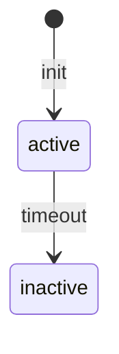

# Specs Publisher — Multi-Format Wiki Generator

Read markdown specs from `.specs/` (or user-specified directories) and publish them in the format of the user's choice. Detects which spec-driven tools generated the files and adapts accordingly.

## Hard Rules (Never Violate)

1. **NEVER render ANY flow, architecture, sequence, state machine, relationship, or process visually using ASCII characters.** Banned patterns include (but are not limited to): `-->`, `──►`, `│`, `├─►`, `└─►`, `▼`, `▲`, `|--|`, `+--`, `►`, `─`, `│`, `┐`, `└`, `┘`, `┌`, `├`, `┤`, `┬`, `┴`, `┼`, `║`, `═`, `╔`, `╗`, `╚`, `╝`, `╠`, `╣`, `╦`, `╩`, `╬`.

2. **Every visual representation MUST be a Mermaid code block:**
   ``````markdown
   ```mermaid
   flowchart TD
       A[Client] --> B[Core API]
       B --> C[External Vendor]
   ```
   ``````

3. **If you catch yourself typing ASCII arrows or boxes — STOP. Use Mermaid instead.**

4. **This applies to ALL output formats** — wiki, chat, markdown, code comments, everything.

5. **If the source markdown contains ASCII diagrams, rewrite them to Mermaid.**

## Trigger

When the user asks to build, generate, serve, or publish docs / wiki from spec markdown files. Also at session end when specs have accumulated without being published.

---

## Diagram Requirement — Always Use Mermaid

Any state flow, sequence, architecture, or process diagram in the output MUST use proper Mermaid syntax inside a fenced code block:

````markdown

````

**Do NOT** render diagrams as ASCII art (text characters like `-->`, `|`, `+--` drawn manually). ASCII diagrams are unreadable in wikis and cannot be edited. Mermaid renders natively in MkDocs Material (via `pymdownx.superfences`) and GitHub-flavored markdown.

When you encounter a diagram description in the source markdowns (e.g., "flow: X → Y → Z" or a text-based state diagram), convert it into proper Mermaid syntax.

Supported Mermaid diagram types for wikis:
- `flowchart` / `graph` — process flows, decision trees
- `sequenceDiagram` — request/response flows, API interactions
- `stateDiagram-v2` — state machines, lifecycle
- `classDiagram` — class structures, relationships
- `erDiagram` — entity-relationship models
- `gantt` — timelines, roadmaps
- `pie` — pie charts (rare, but valid)

---

## Skill Set Structure

This skill comes with companion scripts and subagents to handle deterministic tasks. Use them instead of generating commands from scratch:

```
md-to-wiki/
├── SKILL.md              ← this file (orchestrator)
├── scripts/
│   ├── discover-sources.sh   # scan .specs/ tree
│   ├── discover-sources.ps1  # (PowerShell version)
│   ├── fetch-issues.sh       # gh + curl with caching
│   ├── fetch-issues.ps1      # (PowerShell version)
│   ├── generate-mkdocs.sh    # auto-generate mkdocs.yml
│   ├── generate-mkdocs.ps1   # (PowerShell version)
│   ├── generate-index.sh     # build landing page
│   ├── generate-index.ps1    # (PowerShell version)
│   ├── to-pdf.sh             # pandoc + weasyprint
│   ├── to-pdf.ps1            # (PowerShell version)
│   ├── to-dokuwiki.sh        # pandoc → DokuWiki
│   └── to-dokuwiki.ps1       # (PowerShell version)
├── templates/
│   ├── index.md              # landing page template
│   └── swagger-ui.html       # Swagger UI wrapper
└── agents/
    ├── swagger-builder.md    # subagent for OpenAPI generation
    └── pdf-builder.md        # subagent for PDF generation
```

**Script path:** `SKILL_DIR = $(dirname "$(find ~/.config/opencode/skills/md-to-wiki -name SKILL.md | head -1)")`

**OS detection:** The OS is detected once in the version check step (1a). This sets `$SCRIPT_EXT` (`.sh` or `.ps1`) and `$SCRIPT_RUNNER` (empty on Unix, `powershell -File` on Windows). All script calls use these variables.

**Subagent delegation:** For Swagger and PDF formats, delegate execution to the subagent using the Task tool with the agent's markdown file as the prompt.

**Subagent delegation:** For Swagger and PDF formats, delegate execution to the subagent using the Task tool with the agent's markdown file as the prompt.

---

## Step 1 — Onboarding Interview

Before touching any files, interview the user to build a clear specification of what they need. This eliminates ambiguity and ensures the output matches their real intent.

Use the `Question` tool for all choices. Free-form questions should be asked as text. Resolve ambiguities before moving on — if an answer is vague, drill in with follow-ups.

---

### 1a. Version check — is the skill up to date?

Before proceeding, check if the skill itself is outdated. The skill may be installed as a git clone (from GitHub) or as a direct copy.

```bash
# Check if this is a git repo
SKILL_DIR=$(dirname "$(find ~/.config/opencode/skills/md-to-wiki -name SKILL.md 2>/dev/null | head -1)")
if [ -z "$SKILL_DIR" ]; then
  SKILL_DIR=$(dirname "$(find .opencode/skills/md-to-wiki -name SKILL.md 2>/dev/null | head -1)")
fi
if [ -n "$SKILL_DIR" ] && [ -d "$SKILL_DIR/.git" ]; then
  cd "$SKILL_DIR"
  git fetch origin --quiet 2>/dev/null
  BEHIND=$(git rev-list --count HEAD..origin/main 2>/dev/null || echo 0)
  LOCAL=$(git rev-parse --short HEAD 2>/dev/null)
  REMOTE=$(git rev-parse --short origin/main 2>/dev/null)
  if [ "$BEHIND" -gt 0 ] 2>/dev/null; then
    echo "Skill is $BEHIND commit(s) behind. Local: $LOCAL | Remote: $REMOTE"
    OUTDATED=true
  else
    echo "Skill is up to date ($LOCAL)."
    OUTDATED=false
  fi
else
  OUTDATED=false
fi
```

**After the version check, detect the OS once** — all subsequent script calls reuse these variables:

```bash
case "$(uname -s 2>/dev/null)" in
  Linux|Darwin)
    OS_TYPE="unix"; SCRIPT_EXT=".sh"; SCRIPT_RUNNER=""
    ;;
  MINGW*|MSYS*|CYGWIN*)
    # Git Bash on Windows — can run .sh natively
    OS_TYPE="windows"; SCRIPT_EXT=".sh"; SCRIPT_RUNNER=""
    ;;
  *)
    # Pure PowerShell (no bash) — use .ps1 with powershell runner
    OS_TYPE="windows"; SCRIPT_EXT=".ps1"; SCRIPT_RUNNER="powershell -File"
    ;;
esac
```

Usage later in the flow:
```bash
# Instead of duplicating OS checks, just use the variables:
$SCRIPT_RUNNER "$SKILL_DIR/scripts/<name>$SCRIPT_EXT" <args>
```

If `OUTDATED=true`, ask the user:

> **This skill is $BEHIND commit(s) behind the latest version. Update now?**

- If yes: `cd "$SKILL_DIR" && git pull`, then inform the user: **"The skill has been updated. Please restart the agent/session for the changes to take effect."** Stop and wait for the user to restart before proceeding.
- If no: proceed with the current version

---

### 1b. Welcome and set context

Start with a brief summary of what the skill can do, then ask the opening question:

```
I can publish your spec markdowns into several formats:
  • Pure HTML site (GitHub docs style with search)
  • Swagger / OpenAPI (for API specs)
  • GitHub Wiki tab (push to repo.wiki.git)
  • DokuWiki (self-hosted wiki format)
  • PDF document (single book for review)

Let's start with a quick onboarding so I understand exactly what you need.
```

---

### 1c. Goals — what should the documentation achieve

Ask:

> **What are the main goals of this documentation? Who is it for?**

Probe for:
- **Audience**: Developers? Stakeholders? QA? New team members? External partners?
- **Purpose**: Reference? Onboarding? Compliance? API docs? Progress tracking?
- **Tone**: Technical deep-dive? Executive summary? Both?

If the answer is vague, drill in:

| Vague answer | Follow-up |
|-------------|-----------|
| "Document the project" | Who needs to read it? What decisions will they make from it? |
| "For the team" | Which part of the team — devs, PMs, QA, or all? |
| "API docs" | Who consumes the API — internal services, external partners, mobile apps? |
| "Everything" | That's broad. Let's prioritize — what's the top 3 things someone should find? |

Also ask if there are existing docs they want to replace or complement.

---

### 1d. Scope and context — what does the documentation cover

Ask:

> **What's the scope of this documentation? What should it cover and what should it exclude?**

Probe for:
- **Coverage**: All features? Specific features only? Current state only, or historical decisions too?
- **Depth**: Brief overviews? Full specs with all details? Both?
- **Boundaries**: Are there areas explicitly out of scope? (e.g., "Skip quick tasks", "Only include shipped features", "Exclude deprecated specs")

If the user says "everything" or is unsure, propose a sane default based on what you discover in the file scan:

> "I found these categories. Here's my recommendation for what to include based on a typical documentation site. Feel free to accept, add, or remove."

Keep the user focused — don't let scope creep. If they keep adding, ask:

> "I want to make sure we don't stretch too thin. Let me add this to a 'future expansion' list so we can deliver the current scope first. Is that OK?"

---

### 1e. Source selection — which markdown files to include

Ask:

> **Which markdown files should I use? I can either scan and pick the right ones based on the goals and scope you described, or you can point me to specific files and directories.**

Offer these options:

| Option | What happens |
|--------|-------------|
| **Agent picks** (recommended) | I scan `.specs/`, `docs/`, and related directories, then select files that match your stated goals and scope. |
| **Specify directories** | You tell me which folders to scan. |
| **Specify individual files** | You list exactly which .md files to include. |

#### If "Agent picks" — selection logic

Scan `.specs/`, `docs/`, and any adjacent markdown directories. Then apply rules based on the onboarding answers:

| Goal/Scope | Include | Exclude |
|------------|---------|---------|
| "API docs" | Files with endpoints, contracts, API specs, codebase/INTEGRATIONS.md | PROJECT.md, ROADMAP.md, quick tasks |
| "Onboarding for new devs" | PROJECT.md, codebase/*, feature specs (brief), CONVENTIONS.md | STATE.md (too detailed), quick tasks |
| "Stakeholder review" | PROJECT.md, ROADMAP.md, feature spec.md overviews | design.md, tasks.md (too technical) |
| "Full technical reference" | All | Nothing |
| "Compliance / audit trail" | Everything with dates, decisions, STATE.md | Quick tasks (unless relevant) |

Present your proposed file list to the user for confirmation:

```
Based on your goals, I propose including:
  ✅ .specs/project/PROJECT.md
  ✅ .specs/project/ROADMAP.md
  ✅ .specs/codebase/ARCHITECTURE.md
  ✅ .specs/features/auth/spec.md
  ❌ .specs/features/auth/tasks.md (filtered: stakeholder audience)
  ❌ .specs/quick/* (filtered: out of scope)

Does this look right?
```

#### If "Specify directories" — ask for paths, validate they exist, scan contents

```bash
ls -R <path>/**/*.md 2>/dev/null
```

Present the list and confirm.

#### If "Specify individual files" — ask for file paths one by one, validate each

Check each file exists. If not, ask for correction or suggest alternatives by scanning nearby.

---

### 1f. GitHub Issues/PRs — enrich documentation with original context

Enhance the documentation by linking related GitHub issues and pull requests. This adds traceability from the original problem → spec → implementation.

#### 1f-i. Ask the user first

> **I can enrich the documentation by linking related GitHub issues/PRs as a References appendix. Do you have any issue URLs or numbers to contribute?**

Let the user paste URLs, numbers (`#123`), or say "no, scan the markdowns."

If the user provides links → add them to the fetch list.

#### 1f-ii. Scan markdowns for references

```bash
grep -n -E '(#[0-9]+|Fixes|Closes|Relates to|resolves)' \
  <selected_files> 2>/dev/null
```

Collect all unique references:
- `#123` → current repo
- `owner/repo#456` → cross-repo (mention only, do not fetch)
- Track which source file each reference came from

#### 1f-iii. Present findings and confirm

```
Found 4 references:
  You provided:     #123, #456
  Scanned from specs:  #789 (features/auth/spec.md)
  Cross-repo (mention only): owner/detran-api#12

Include these? [Yes / Select which ones / Skip all]
```

If the user selects specific ones, remove the rest from the fetch list.

If "Skip all" → mark `FETCH_ISSUES=false` and skip to the next step.

#### 1f-iv. Detect the repository

```bash
REPO_URL=$(git remote get-url origin 2>/dev/null)
OWNER=$(echo "$REPO_URL" | sed -n 's/.*github.com[:\/]\([^\/]*\)\/\(.*\)\.git/\1/p')
REPO=$(echo "$REPO_URL" | sed -n 's/.*github.com[:\/]\([^\/]*\)\/\(.*\)\.git/\2/p')
```

If not detectable, ask the user for the `owner/repo` slug.

#### 1f-v. Fetch issues/PRs (try gh → fallback curl)

Use the companion script instead of writing bash from scratch:

```bash
SKILL_DIR=$(dirname "$(find ~/.config/opencode/skills/md-to-wiki -name SKILL.md | head -1)")
$SCRIPT_RUNNER "$SKILL_DIR/scripts/fetch-issues$SCRIPT_EXT" "$OWNER/$REPO" <num1> <num2> ...
```

The script handles:
- Cache check (uses `.specs/issues/cache/<num>.json` if exists)
- `gh` CLI (tries both issue and PR views)
- `curl` fallback to GitHub REST API
- Auth detection (returns `AUTH_NEEDED` line for 401/403)
- Caching newly fetched data

Parse the `---SUMMARY---` section from the output:

```
GH|123|Add CPF validation
CURL|456|Rate limiting
CACHED|789|Fix timeout bug
AUTH_NEEDED|101|
```

#### 1f-vi. Handle authentication errors

If any fetch returned 401/403:

> **Some issues couldn't be fetched because they require authentication. Want to configure GitHub auth?**
>
> - **Yes** → "Set the GITHUB_TOKEN environment variable or run `gh auth login` in your terminal, then I'll retry."
> - **No** → "Continue with only the already available context?"
>   - Yes → skip failed fetches, proceed with what was fetched successfully
>   - No → abort the References appendix, proceed without it

#### 1f-vii. Process fetched data

For each successful fetch:

1. Extract JSON fields: `number`, `title`, `body`, `state`, `url`, `labels`, `createdAt`, `closedAt`/`mergedAt`, `comments`
2. Truncate `body` to 2000 characters — if longer, append `... [View full issue](<url>)`
3. Filter comments: keep only decision-making comments (accept/reject reasoning, alternatives, technical constraints). Skip bot comments, "+1", automated messages.

For cross-repo references (`owner/repo#num`): do not fetch. Note them as "See owner/repo#num" in external references.

#### 1f-viii. Summary after fetch

```
Fetched:
  ✅ #123 — Add CPF validation       (closed, from cache)
  ✅ #456 — Rate limiting            (open, via gh)
  ✅ #789 — Fix timeout bug          (merged PR, via curl)
  ⚠️  owner/detran-api#12            (cross-repo, not fetched)
  ❌ #101 — Not found (404)          (skipped)

References appendix will include 3 items + 1 external mention.
```

Set `FETCH_ISSUES=true` and store the processed data for appendix generation.

---

### 1g. Ambiguity resolution checklist

Before moving on, verify:

- [ ] **Audience** is concrete (e.g., "backend devs new to the project", not just "devs")
- [ ] **Purpose** is concrete (e.g., "reduce onboarding time from 2 weeks to 3 days", not just "documentation")
- [ ] **Scope boundaries** are explicit (what's included AND what's excluded)
- [ ] **Files** are confirmed (user accepted or modified the proposed list)
- [ ] **Tone** is clear (technical, executive, mixed)

If any are still fuzzy, ask a targeted follow-up. Do NOT proceed until all checkboxes are green.

> **Ambiguity detection heuristics:**
> - If an answer is ≤3 words, it's probably vague — drill in
> - If the user says "you decide" or "whatever you think best", propose 2-3 concrete options with trade-offs
> - If the user contradicts themselves (e.g., "just API docs" then "include everything"), flag it explicitly: "I noticed you said API docs but also want everything — which takes priority?"

---

### 1h. Summarize back to the user

After the interview, present a concise summary:

```
## Documentation Plan

Audience:         Backend developers joining the project
Purpose:          Reduce onboarding time
Scope:            Project overview, architecture, all feature specs
Excluded:         Quick tasks, detailed implementation tasks
Source files:     12 files from .specs/ (auto-selected)
GitHub issues:    3 issues + 1 PR (will append References appendix)
Format:           To be decided next
Tone:             Technical with one-paragraph executive summary per feature

Does this capture everything? Any changes?
```

Let the user amend before proceeding.

---

## Step 2 — Recommend format based on onboarding

Now use the onboarding answers to recommend the best format. Present the menu with a highlighted recommendation:

| # | Format | Best when |
|---|--------|-----------|
| 1 | **Pure HTML (MkDocs Material)** ← *recommended* | General purpose, multiple audiences, needs search and nav |
| 2 | **Swagger / OpenAPI** | Goals are API-focused, audience is developers integrating |
| 3 | **GitHub Tab Wiki** | Team already lives in GitHub, wants docs co-located with code |
| 4 | **DokuWiki** | Organization has a self-hosted DokuWiki that must be kept in sync |
| 5 | **PDF Document** | Stakeholder review, compliance, offline distribution, single-file deliverable |

Explain why you're recommending a specific format based on their answers. Let the user override.

---

## Step 3 — Execute the chosen format

### Format 1 — Pure HTML (MkDocs Material)

Use MkDocs with the Material theme — produces the exact GitHub docs look with search, navigation, and responsive layout.

```bash
pip install mkdocs mkdocs-material
```

Generate `mkdocs.yml` and `docs/index.md` using the companion scripts:

```bash
SKILL_DIR=$(dirname "$(find ~/.config/opencode/skills/md-to-wiki -name SKILL.md | head -1)")

$SCRIPT_RUNNER "$SKILL_DIR/scripts/generate-mkdocs$SCRIPT_EXT" "<Project Name>" .specs
$SCRIPT_RUNNER "$SKILL_DIR/scripts/generate-index$SCRIPT_EXT" "<Project Name>" "<audience>" .specs/features
```

These scripts automatically:
- Scan `.specs/` for all markdown files
- Generate a proper nav structure (project → codebase → features → quick tasks)
- Create a tailored landing page based on the onboarding audience
- Skip files that don't exist

Then symlink and build:

```bash
mkdir -p docs
ln -s ../.specs docs/specs
mkdocs build
```

Output: `site/index.html`. Offer to serve with `mkdocs serve` for live preview.

**GitHub Pages deploy:**
```bash
mkdocs gh-deploy
```

**If `FETCH_ISSUES=true`** → generate `docs/references.md` (see Step 3b) and add it to the mkdocs.yml nav:
```yaml
nav:
  ...
  - References: references.md
```

Rebuild after adding.

---

### Format 2 — Swagger / OpenAPI

Parse markdown specs for API contracts and generate an OpenAPI 3.0 spec served with Swagger UI.

**Delegate to the swagger-builder subagent** for the heavy lifting. Read the agent prompt at:

```
SKILL_DIR/agents/swagger-builder.md
```

Launch a subagent via the Task tool with:
- The swagger-builder.md file as the prompt
- The list of selected API-related files
- The project name
- The template file `$SKILL_DIR/templates/swagger-ui.html`

**Before delegation**, scan for API-related files to pass to the subagent:
- Files named `api.md`, `openapi.md`, `contract.md`, `endpoints.md`
- Any markdown containing `## Endpoints`, `## API`, `## Routes`, `## OpenAPI`
- Any `spec.md` referencing HTTP methods (GET, POST, PUT, DELETE, PATCH)

Present findings and ask the user to confirm.

**After the subagent returns**, take its output (openapi.yml + HTML) and present it to the user.
```html
<!DOCTYPE html>
<html>
<head>
  <link rel="stylesheet" href="https://cdn.jsdelivr.net/npm/swagger-ui-dist@5/swagger-ui.css">
</head>
<body>
  <div id="swagger-ui"></div>
  <script src="https://cdn.jsdelivr.net/npm/swagger-ui-dist@5/swagger-ui-bundle.js"></script>
  <script>
    SwaggerUIBundle({ url: "openapi.yml", dom_id: "#swagger-ui" })
  </script>
</body>
</html>
```

Output: `site/api-docs/index.html` + `openapi.yml`.

**If `FETCH_ISSUES=true`** → generate `site/references.html` with the appendix (see Step 3b). Add `externalDocs` links on each endpoint pointing to the corresponding issue.

---

### Format 3 — GitHub Tab Wiki

Push the selected markdowns to the GitHub wiki tab.

#### 3a. Discover the remote

```bash
git remote get-url origin
```

The wiki repo is at `https://github.com/<owner>/<repo>.wiki.git` (or `git@github.com:<owner>/<repo>.wiki.git`).

#### 3b. Clone wiki repo

```bash
git clone <wiki-url> .wiki
cd .wiki
```

If the wiki doesn't exist yet (404 error), tell the user to enable the Wiki in their GitHub repo Settings first.

#### 3c. Convert spec files to wiki pages

Map the selected spec files into flat wiki pages:

| Source | Wiki page |
|--------|-----------|
| `.specs/project/PROJECT.md` | `Project-Overview.md` |
| `.specs/project/ROADMAP.md` | `Roadmap.md` |
| `.specs/project/STATE.md` | `State-Decisions.md` |
| `.specs/codebase/ARCHITECTURE.md` | `Codebase-Architecture.md` |
| `.specs/features/auth/spec.md` | `Feature-Auth.md` |
| `.specs/features/auth/design.md` | `Feature-Auth-Design.md` |
| `.specs/quick/001-api-task/TASK.md` | `Quick-Task-001.md` |

Rules:
- Create a `_Sidebar.md` with navigation links based on the selected files
- Create a `Home.md` as the landing page (use onboarding answers to tailor it)
- Preserve markdown formatting
- Update relative links to work in the wiki repo

Generate the sidebar dynamically:
```markdown
## Project
- [Project Overview](Project-Overview)
- [Roadmap](Roadmap)

## Codebase
- [Architecture](Codebase-Architecture)
...

## Features
- [Auth](Feature-Auth)
...
```

#### 3d. Commit and push

```bash
git add -A
git commit -m "docs: publish specs to wiki [skip ci]"
git push origin master    # GitHub wiki uses 'master' branch
```

Output: The project's GitHub Wiki tab now has the selected specs as pages.

**If `FETCH_ISSUES=true`** → generate `References.md` in the wiki repo (see Step 3b), commit and push together with the other pages.

---

### Format 4 — DokuWiki

Convert selected markdowns to DokuWiki syntax and generate a ready-to-import directory using the companion script:

```bash
SKILL_DIR=$(dirname "$(find ~/.config/opencode/skills/md-to-wiki -name SKILL.md | head -1)")
$SCRIPT_RUNNER "$SKILL_DIR/scripts/to-dokuwiki$SCRIPT_EXT" wiki-export <selected_files>
```

The script handles:
- Detecting pandoc (tells user to install if missing)
- Converting paths to DokuWiki page IDs (`.specs/project/PROJECT.md` → `specs:project:project`)
- Generating the `data/pages/` namespace structure
- Writing import instructions to `wiki-export/README.md`

Output: `wiki-export/` directory ready for DokuWiki import.

**If `FETCH_ISSUES=true`** → first generate the References appendix as a markdown temp file, then convert it via the DokuWiki script alongside the other files.

---

### Format 5 — PDF Document

Generate a single PDF book from the selected spec markdowns.

**Delegate to the pdf-builder subagent** for the heavy lifting. Read the agent prompt at:

```
SKILL_DIR/agents/pdf-builder.md
```

Launch a subagent via the Task tool with:
- The pdf-builder.md file as the prompt
- The ordered list of selected files
- The project name

**Before delegation**, prepare the ordered file list:

1. Title page (project name, date, auto-generated notice)
2. Table of contents (pandoc handles this)
3. Project Overview (PROJECT.md)
4. Roadmap (ROADMAP.md)
5. State / Decisions (STATE.md)
6. Codebase docs (if included)
7. Each feature (spec.md, design.md, tasks.md) — grouped by feature
8. Quick tasks (if included)

**After the subagent returns**, verify the PDF was generated at `specs-book.pdf` and present it to the user.
```

#### 5c. Convert to PDF

```bash
pandoc specs-book.md -f markdown --pdf-engine=weasyprint \
  -o specs-book.pdf \
  --metadata title="<Project Name> — Specifications" \
  --toc --toc-depth=3
```

Fallback:
```bash
pandoc specs-book.md -f markdown --pdf-engine=wkhtmltopdf \
  -o specs-book.pdf \
  --metadata title="<Project Name> — Specifications" \
  --toc --toc-depth=3
```

#### 5d. Verify

- Check PDF renders correctly
- Verify the table of contents has correct page numbers
- Confirm code blocks are readable
- Check that images (diagrams) are embedded

Output: `specs-book.pdf`.

**If `FETCH_ISSUES=true`** → generate the References appendix (see Step 3b below).

---

## Step 3b — Generate References Appendix

If `FETCH_ISSUES=false` (user skipped or no references found), skip this step entirely.

Otherwise, generate a References appendix containing the fetched issues and PRs. Adapt the content to the chosen format.

### Appendix content structure

```markdown
## References

### Issues

| # | Title | State | Source |
|---|-------|-------|--------|
| [#123](url) | Add CPF validation | ✅ Closed | features/auth/spec.md |
| [#456](url) | Rate limiting | 🔄 Open | features/detran/spec.md |

---

#### #123 — Add CPF validation

*State: closed | Labels: enhancement, api | Opened: 2025-01-15*

(fetched body, truncated to ~2000 chars)

> *"We chose to validate via external API instead of local regex to avoid maintaining state rules."* — @joao (key comment)

[View full issue](https://github.com/owner/repo/issues/123)

#### #456 — Rate limiting

...

---

### Pull Requests

| # | Title | State | Linked issue |
|---|-------|-------|-------------|
| [#789](url) | feat: add CPF validation | ✅ Merged | #123 |

---

### External References

- owner/detran-api#12 — mentioned in features/detran/spec.md (external repo, not fetched)
```

### Per-format placement

| Format | Where to put the appendix |
|--------|--------------------------|
| **MkDocs HTML** | `docs/references.md` with nav entry `- References: references.md` |
| **Swagger** | Standalone `references.html` page + `externalDocs` links on endpoints |
| **GitHub Wiki** | `References.md` page in the wiki repo |
| **DokuWiki** | `references:start.txt` as a new namespace |
| **PDF** | Last chapter before the final page |

### Rendering rules

- Truncated bodies: append `[...](full issue URL)` link
- Key comments: render as blockquotes with attribution (`— @author`)
- External references: italicized, with "(external repo, not fetched)" note

## Step 4 — Offer deployment

After generating output, ask if they want to deploy:

| Format | Deployment |
|--------|-----------|
| Pure HTML | GitHub Pages (`mkdocs gh-deploy`), Netlify, Vercel, any static host |
| Swagger | Surge, GitHub Pages, or serve with Docker |
| GitHub Wiki | Already pushed to GitHub |
| DokuWiki | Directory ready for manual import to DokuWiki instance |
| PDF | Ready for email, download, or print |

## Step 5 — Cleanup (optional)

Offer to remove intermediate files. Ask before deleting anything.

## Multi-Directory Input

If the user wants to include markdown from multiple sources (e.g., `.specs/` + `docs/` + `notes/`), merge them:

```bash
mkdir -p merged-specs
cp -r .specs/* merged-specs/
cp -r docs/* merged-specs/
```

Then use `merged-specs/` as the source.

## Sharing

To share with colleagues, copy the `md-to-wiki/` folder into their `.config/opencode/skills/` (global) or `.opencode/skills/` (project-local). Dependencies vary by format:
- Pure HTML: `mkdocs`, `mkdocs-material`
- Swagger: `node` + `npx`, or just a browser
- GitHub Wiki: `git`
- DokuWiki: `pandoc`
- PDF: `pandoc` + `weasyprint` or `wkhtmltopdf`
